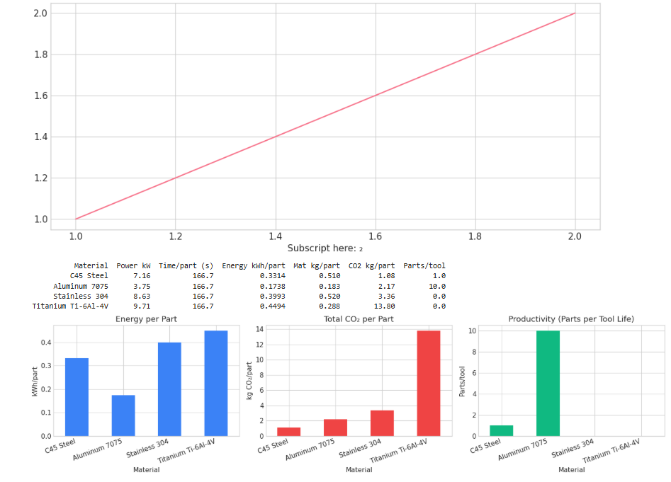
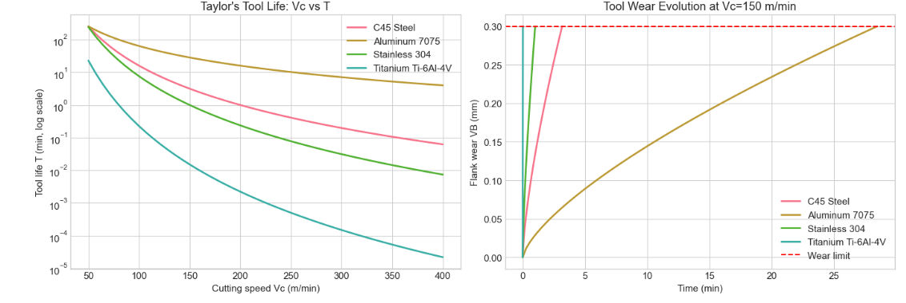
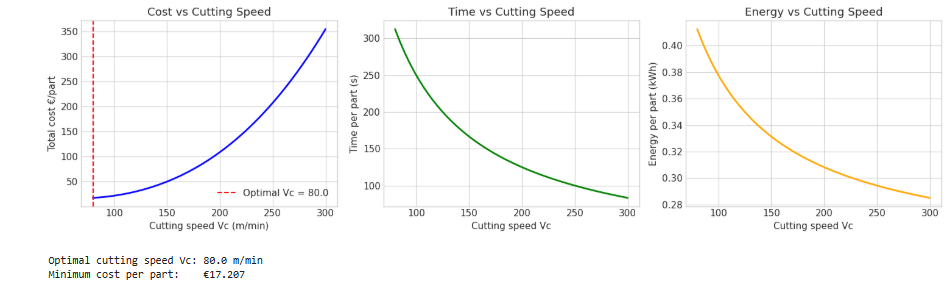
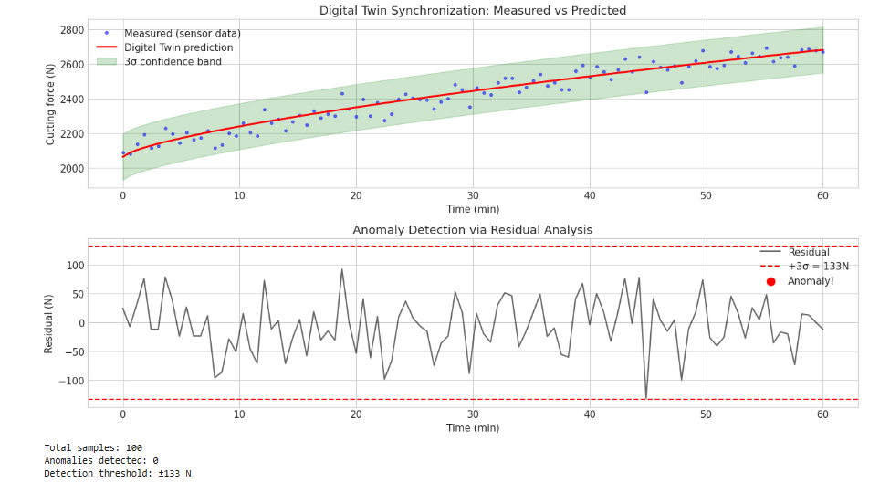

# 🏭 CNC Digital Twin: Process Simulation + Sustainability Analytics
 

 
## Overview
Complete digital twin of a CNC milling operation built in Jupyter Notebook.
Combines cutting force modeling, tool wear prediction, energy analytics,
sustainability KPIs, process optimization, and real-time anomaly detection.
 
## 📓 View the Notebook
**[Open CNC_Digital_Twin.ipynb](CNC_Digital_Twin.ipynb)** — renders directly on GitHub!
 
## Contents
1. Kienzle cutting force model (4 industrial materials)
2. Taylor's tool life equation
3. Power consumption (idle + cutting split)
4. Surface roughness prediction
5. Sustainability KPIs (CO₂, material kg/part, productivity)
6. Cost optimization via SciPy
7. Digital twin synchronization with anomaly detection
 
## Key Models
**Cutting Force (Kienzle):** Fc = kc11 · b · h^(1−mc)
**Tool Life (Taylor):** Vc · T^n = C
**Power:** P_total = P_idle + Fc·Vc/60/1000
 
## Materials Covered
| Material | kc11 (N/mm²) | mc | CO₂ (kg/kg) |
|----------|--------------|-----|-------------|
| C45 Steel | 2,100 | 0.26 | 1.85 |
| Aluminum 7075 | 800 | 0.20 | 11.5 |
| Stainless 304 | 2,500 | 0.30 | 6.15 |
| Titanium Ti-6Al-4V | 2,800 | 0.32 | 47.3 |
 
## Plots

 
## Relevance to RPTU MEfIS
- Specialization: **"Digital Production Technologies"**
- Digital modelling ✅
- Process simulation ✅
- Sustainable manufacturing ✅
- Industry 4.0 ✅
- Digital twins ✅
 
## Tools
Python, Jupyter, NumPy, Pandas, Matplotlib, Seaborn, SciPy
 
## Author
**Oscar Vincent Dbritto** | M.Sc. Digitalization & Automation | [Portfolio](https://oscardbritto.framer.website/) | [Linkedin](https://www.linkedin.com/in/oscar-dbritto/)
